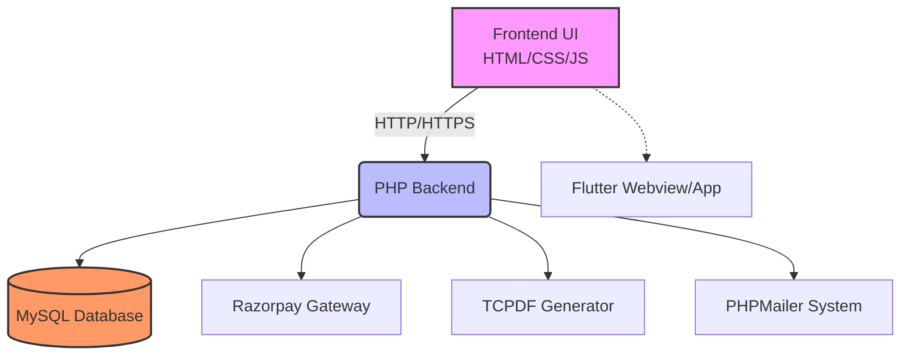

<!-- HEADER BANNER -->
<p align="center">
  
</p>

<div align="center">
  

  <br/><br/>

  <h1>
    
  </h1>

  <p><b>Revolutionizing the Visa Application Process through Artificial Intelligence & Automated Workflows.</b></p>
  
  <p>
    <a href="https://php.net">
      
    </a>
    <a href="https://mysql.com">
      
    </a>
    <a href="https://developer.mozilla.org/en-US/docs/Web/JavaScript">
      
    </a>
    <a href="https://razorpay.com">
      
    </a>
    <a href="https://tcpdf.org/">
      
    </a>
  </p>
</div>

<hr style="border: 1px solid #DC143C;" />

## 🌟 About ASK-VISA

**ASK-VISA** is an advanced, automated immigration and visa consultation system designed to simplify and streamline the application process. Utilizing intelligent algorithms, the platform guides applicants through their specific requirements, manages document processing, supports automated invoice and PDF generation, and securely processes payments via Razorpay integration.

Whether you're looking to visit, study, or work abroad, ASK-VISA acts as your **personal AI-powered immigration consultant**.

<div align="center">
  
</div>

<hr style="border: 1px solid #ddd;" />

## 🚀 Key Features

| Feature | Description | Icon / Badge |
| :--- | :--- | :---: |
| 🤖 **AI-Driven Guidance** | Smart questionnaires to determine exact visa requirements for different countries. |  |
| 📄 **Automated Docs** | Real-time PDF generation for applications, forms, and invoices using TCPDF. |  |
| 💳 **Secure Payments** | Integrated Razorpay checkout for seamless transaction processing. |  |
| 📧 **Auto Notifications** | Real-time email alerts and applicant tracking via PHPMailer. |  |
| 📊 **Admin Dashboard** | Comprehensive control panel for reviewing and managing applications. |  |
| 📱 **Mobile Ready** | Fully responsive Web Application + Flutter Android Webview App included. |  |

<hr style="border: 1px solid #ddd;" />

## 📸 System Showcase & Visuals

Here is a glimpse of the ASK-VISA platform in action, showcasing its modern, user-friendly interface powered by high-quality design.

<div align="center">
  <table style="border-collapse: collapse; border: none; width: 100%;">
    <tr>
      <td width="50%" align="center" style="border: none; padding: 10px;">
        
      </td>
      <td width="50%" align="center" style="border: none; padding: 10px;">
        
      </td>
    </tr>
    <tr>
      <td width="50%" align="center" style="border: none; padding: 10px;">
        
      </td>
      <td width="50%" align="center" style="border: none; padding: 10px;">
        
      </td>
    </tr>
    <tr>
      <td width="50%" align="center" style="border: none; padding: 10px;">
        
      </td>
      <td width="50%" align="center" style="border: none; padding: 10px;">
        
      </td>
    </tr>
  </table>
  <br/>
  <b>Powered by:</b> <br/><br/>
  
</div>

<hr style="border: 1px solid #ddd;" />

## ⚙️ Tech Stack & Architecture



<div align="center">

| Area | Technology |
|---|---|
| **Backend Core** | PHP (Native Architecture) |
| **Database** | MySQL |
| **Client-Side** | HTML5, CSS3, JavaScript (ES6) |
| **Mobile App** | Flutter (Dart) WebView / Native Android |
| **PDF Engine** | TCPDF (Dynamic Report / Receipt Generator) |
| **Comm System** | PHPMailer |
| **Payments** | Razorpay REST API |
| **Testing** | Node.js, Puppeteer |

</div>

<hr style="border: 1px solid #ddd;" />

## 🛠️ Quick Start & Installation

To run the application locally on your Apache/Nginx (XAMPP/WAMP/Laragon) environment, follow these steps:

### 1️⃣ Clone the Repository
```bash
git clone https://github.com/walterhydra/ASKVISA-APP.git
cd ASKVISA-APP
```

### 2️⃣ Database Configuration
*   Ensure your **MySQL** service is running.
*   Import the database using the provided `public_html/local_db.sqlite` script or manual `.sql` file (`run_sql_local.php`).
*   Open `public_html/config.php` and `public_html/db.php` and update your MySQL connection credentials:
```php
$hostname = "localhost";
$username = "root";
$password = "";
$database = "askvisa_db";
```

### 3️⃣ Running the Flutter Webview App (Optional)
```bash
cd askvisa_webview_app_source
flutter pub get
flutter run
```

### 4️⃣ Launch the Service
*   Map your local web server root to the cloned directory (specifically `public_html` folder).
*   Open your browser to: `http://localhost/ASKVISA-APP/public_html`

<hr style="border: 1px solid #ddd;" />

<div align="center">
  
</div>

<div align="center">
  <a href="https://github.com/walterhydra/ASKVISA-APP"></a>
  <a href="https://github.com/walterhydra/ASKVISA-APP"></a>
  <br/><br/>
  
</div>
